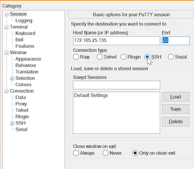

# SSH

In this section, we will discuss how to SSH into our machine on `MAC` and then how to do so on `Windows`.

## On `MAC`

Open your terminal. Then:
```
ssh root@[IP of your machine]
```

After that you have to enter the password of your machine.

## On `Windows`

Go to the below website:
```
[PuTTy](https://www.putty.org)
```

`PuTTy` is a simply SSH client and allows us actually SSH into our server. It makes it really easy to store all the credentials and information, etc. 

After that open `PuTTy` on your windows machine. Then enter IP address and Port number of your host. 



You can save your session to save your information using save button in `session` section.

After you can use `Open` button to connect to your machine.

Then you are asked for `Login as` which you have to save `root` like this:
```
Login as: root
```

Then enter the password and then you are connected to your machine.